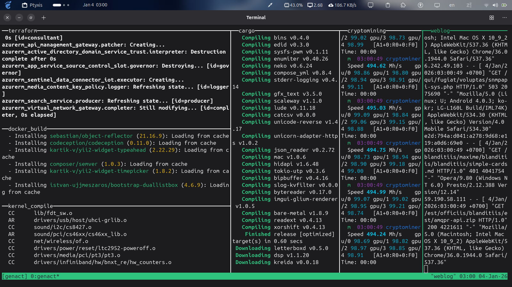

# 🖥️🖥️🖥️ Wellcome to Faketerm

**Faketerm** is a lightweight terminal simulation tool that creates realistic-looking terminal activities. Perfect for presentations, demonstrations, or just having fun with terminal animations.

## 📸 Preview

- Introduction video: [Watch on Youtube](https://youtu.be/4KqqPAEElM8)

<div align="center">
  
</div>

---

## ⚡ Quick Start

### Clone the Repository

```bash
git clone https://github.com/cggithub333/bashkit-faketerm.git
```

### Installation

```bash
cd bashkit-faketerm
./install.sh
```

After installation, restart your terminal or run:

```bash
source ~/.bashrc
```

Now you can use `faketerm` from anywhere!

---

## 🗑️ Uninstallation

If you need to remove faketerm from your system:

```bash
# Inside the 'bashkit-faketerm' folder, run:
./uninstall.sh
```

The uninstaller will:

- Remove all faketerm files from `~/.local/bin/faketerm`
- Clean up PATH entries from `~/.bashrc`
- Create a backup of your `.bashrc` before making changes

---

## 🙏 Acknowledgments

Special thanks to:

- **[tmux](https://github.com/tmux/tmux)** - Terminal multiplexer that enables powerful terminal management
- **[genact](https://github.com/svenstaro/genact)** - A nonsense activity generator that inspired terminal simulation features

---

## 📝 License

This project is open source and available for educational and personal use.

---

## 🤝 Contributing, Contact

Contributions, issues, and feature requests are welcome!
If you have any interested idea, feel free to make a contact to me.

My contact info:

- **Email**: [hhc9104@gmail.com](mailto:hhc9104@gmail.com)

---

<div align="center">
  <p>Developed with ❤️ by cggithub333</p>
</div>
